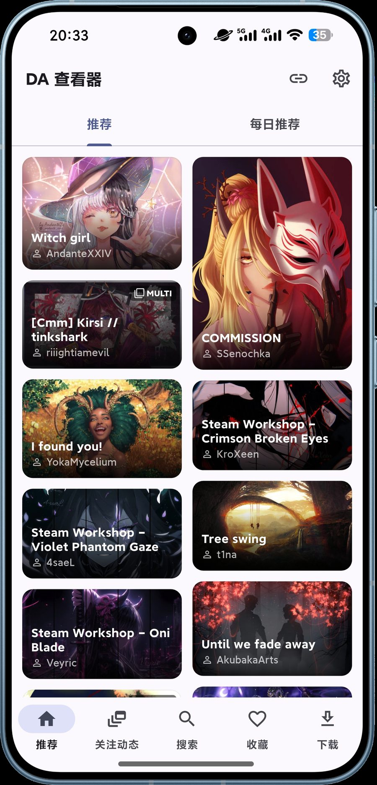
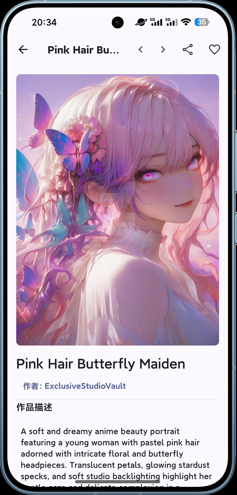
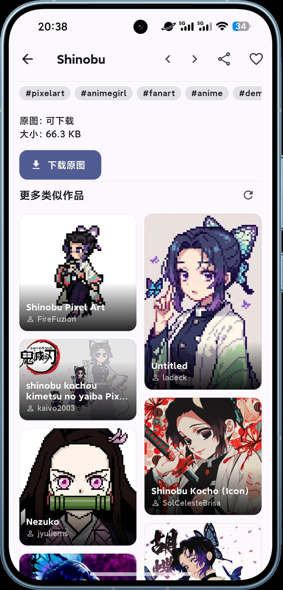

# DAViewer

<p align="center">
  
</p>

**语言 / Language:** 中文 · [English](README.en.md)

> DeviantArt 官方已停止维护其移动客户端。DAViewer 是一个基于
> [DAKit](https://github.com/redtidev1918/dakit) 的开源 DeviantArt 客户端，
> 面向 Android、macOS 与 Windows，以原生应用提供网页版的主要功能。

[](https://github.com/redtidev1918/daviewer/stargazers)
[](LICENSE)
[](https://github.com/redtidev1918/daviewer/releases)
[](https://github.com/redtidev1918/daviewer/releases)
[](https://flutter.dev)

## 截图预览

<table align="center">
  <tr>
    <td align="center"><br /><sub>首页推荐</sub></td>
    <td align="center"><br /><sub>作品详情</sub></td>
    <td align="center"><br /><sub>相关推荐</sub></td>
  </tr>
</table>

## 为什么做这个项目

- DeviantArt 官方已停止维护其客户端 App；
- 网页版功能齐全（个性化推荐、画廊、标签、收藏、关注、下载），但缺少桌面/移动
  原生体验；
- 本项目把网页版的完整能力 + 原生交互组合起来，开箱即用，无需自己注册 OAuth 应用。

## 功能特性

- **登录**：一次登录同时完成网页会话 + OAuth（内置公开 client id，开箱即用，无需注册 OAuth 应用）
- **推荐流**：首页「推荐」为网页版个性化推荐（`rfy/deviations`），与官网一致
- **搜索**：关键词搜索 + 历史记录 + 粘贴 DeviantArt 链接直达作品/作者
- **作品详情**：保留进入详情前的作品序列，可连续左右滑动或使用顶部按钮查看前后作品；页面跟随手势并按方向平滑过渡，不会闪现；单图全屏在 1× 时也可切作品，放大后手势只用于平移；多图先翻内部页面，到首尾后继续滑动才切作品
- **媒体**：图片统一双击/捏合缩放；视频优先最高画质、可拖进度并支持失败重试；GIF 带缓存和加载进度；富文本图片带缓存、占位和重试
- **相关内容**：详情页原生展示「更多类似作品」，同时兼容 DeviantArt 当前流式页面缓存与旧页面状态，必要时再使用官方接口；更新时保留现有作品，完成后只提供用户可理解的新增、无变化或暂无结果提示
- **标签**：详情、搜索和标签页统一使用单行紧凑标签条；关注流等精简列表缺失标签时会从官方作品 metadata 补全，并避免后续刷新覆盖完整数据
- **作者**：资料（含作者简介）、画廊、**自定义分画廊（画集）**、收藏夹、关注
- **社交**：收藏作品（显示收藏态）、关注/取消关注作者、关注用户列表、通知（谁更新了作品）
- **下载**：先按当前账号实时确认原图权限；不可下载时直接显示登录、购买、次数用尽、作者关闭等原因，图片可明确降级保存最高画质预览；后台失败原因会保留在下载列表；支持打开文件/文件夹及删除前二次确认
- **双语**：中文 / English 切换
- **代理**：自动检测系统代理 + 手动配置（国内访问必需）

## 与 DAKit 的关系

`DAViewer` 是应用，DAKit 是 SDK。客户端只依赖 DAKit，不复制 SDK 代码。
DAKit 已发布到 pub.dev，客户端直接使用版本化依赖：

```yaml
dependencies:
  dakit_core: ^0.1.11
  dakit_api: ^0.1.18
  dakit_flutter: ^0.1.8
```

边界保持清晰：OAuth、官方 API 映射、领域模型与后台传输属于 DAKit；网页版个性化流、
网页当前相关推荐、稀疏数据补全和原生页面交互属于 DAViewer。上游列表允许省略标签等
详情字段，官方标签补全由 DAKit 的 `deviation/metadata` 适配器提供；App 的统一作品
缓存会保留已补全数据，避免刷新时发生“数据降级”。详细边界与
数据流见 [架构说明](docs/architecture.md)。首次登录先提交网页 Cookie/CSRF，再完成
OAuth；未登录是正常引导状态，不会被当成推荐加载错误。

## 安装

从 [Releases](https://github.com/redtidev1918/daviewer/releases) 下载对应平台的安装包：

- **Android**：`DAViewer-<版本>.apk`
- **macOS 12+ 未签名测试版**：`DAViewer-<版本>-macos-unsigned-preview.zip`
  （同时支持 Intel 与 Apple Silicon；解压后拖入「应用程序」）
- **Windows**：`DAViewer-<版本>-windows.zip`（解压后运行 `DAViewer.exe`）

> **⚠️ macOS 未签名测试版：** 当前包没有 Apple Developer ID 签名，也没有经过 Apple
> 公证；内部只有用于校验包完整性的 ad-hoc 签名。首次打开可能被 Gatekeeper 拦截，
> 登录或升级后访问 OAuth 令牌时，macOS 钥匙串也可能要求输入 Mac 登录密码。该密码由
> macOS 系统接收，DAViewer 不会读取或获得密码。只应使用本仓库 Release 的原始文件；
> 如果不能接受这些系统提示，请不要安装此测试版。

## 使用前准备

普通用户只需要一个 DeviantArt 账号，无需注册 OAuth 应用 —— 客户端内置了
公开的 client id（Public OAuth client 没有 secret，client id 可以随应用分发）。

> 登录需要以下 OAuth 权限（应用启动时自动申请）：`basic`、`browse`、
> `collection`（收藏）、`user`（关注列表）、`user.manage`（关注/取消关注）、
> `gallery`、`feed`。

### 开发者：覆盖内置 client id

如果想用自己的 OAuth 应用（例如开发调试），通过 `--dart-define` 覆盖：

```shell
flutter run -d macos --dart-define=DAKIT_CLIENT_ID=你的_PUBLIC_CLIENT_ID
```

> 用自己的应用时，需在其白名单中精确加入 `dakit://oauth/callback`。

## 运行

```shell
flutter pub get
flutter run -d macos     # macOS
flutter run -d android   # Android
flutter run -d windows   # Windows
```

## 代理

应用运行时会自动读取系统代理（macOS 通过 `scutil`，Windows 通过注册表）。若需手动指定，
可在「设置 → 网络代理」中填写 `host:port`。

`flutter pub get` 走 Dart HTTP 客户端，不走 Git 代理；如需代理访问 pub.dev：

```shell
export http_proxy=http://127.0.0.1:7890
export https_proxy=http://127.0.0.1:7890
# 也支持只设置一个通用代理（大小写变量均可）：
# export all_proxy=http://127.0.0.1:7892
export no_proxy=localhost,127.0.0.1
flutter pub get
```

DAViewer 自身也识别 `http_proxy` / `https_proxy` / `all_proxy` 及其大写形式；从
Finder 直接启动时通常不会继承终端环境变量，此时请使用系统代理或 App 内的
「设置 → 网络代理」。

Gradle Wrapper 使用 JVM 下载工具链，不保证读取 `all_proxy`。Android 构建若需代理，
请显式传入 JVM 参数：

```shell
export GRADLE_OPTS="-Dhttp.proxyHost=127.0.0.1 -Dhttp.proxyPort=7892 -Dhttps.proxyHost=127.0.0.1 -Dhttps.proxyPort=7892"
flutter build apk --debug
```

## 构建 Release

推送到 `main` 会触发 CI 的质量检查与 Android/macOS/Windows 构建；打 `v*` 标签会自动创建
GitHub Release 并上传构建产物。Release 说明直接取对应版本的 `CHANGELOG.md` 章节，
历史 Release 与标签都会保留。

Release APK 始终使用 upload keystore 签名（来自 CI 的 `KEYSTORE_B64` /
`KEYSTORE_PROPERTIES` secret）；本地无 `android/key.properties` 时 release 构建会
直接报错，避免误用 debug 签名导致「无法覆盖安装」的签名不一致问题。

macOS CI 会重新应用仓库中的 Release 权限、验证 ad-hoc 签名与双架构，并实际启动应用
至少 8 秒。产物始终以 `macos-unsigned-preview` 命名；只有配置 Apple Developer ID
Application 证书、Hardened Runtime 与 Apple 公证后，才能移除该标记。

### 一键发布（推荐）

Actions → **Release** → Run workflow → 选 `patch` / `minor` / `major`（或填具体
版本号）→ 运行。它会自动改版本号、提交、推 tag，随后 CI 构建并发布。

本地验证构建：

```shell
flutter build apk --release          # Android APK（需 android/key.properties）
flutter build macos --release        # macOS 应用
flutter build windows --release      # Windows 应用
```

## 构建工具链

Flutter 3.47 默认使用 AGP 9.1.0，但稳定版 `flutter_inappwebview`（6.1.5）的
Android 子包仍引用 AGP 9 已删除的 `proguard-android.txt`，而其 beta 版的 macOS
子包在 Swift 6 下编译不过。因此本项目**固定使用**以下工具链（偏离 Flutter 默认，
但满足 Flutter 3.47 的 Gradle ≥ 8.14 / Kotlin ≥ 2.2.20 下限）：

| 组件 | 版本 | 说明 |
| --- | --- | --- |
| Android Gradle Plugin | `8.13.2` | 8.x 仍保留 `proguard-android.txt`，且支持 compileSdk 36 |
| Gradle | `8.14.2` | Flutter 3.47 最低要求 8.14 |
| Kotlin | `2.2.20` | Flutter 3.47 最低要求 2.2.20 |
| flutter_inappwebview | `6.1.5`（精确锁定） | 稳定版；不要升到 `6.2.0-beta`（macOS 会编译失败） |

这些值位于 `android/settings.gradle.kts`、`android/gradle/wrapper/gradle-wrapper.properties`
与 `pubspec.yaml`。升级插件或 Flutter 版本前，需先确认 `flutter_inappwebview`
的 Android/macOS 子包与新的 AGP/Swift 工具链兼容。

## 项目结构

```text
lib/
  main.dart                    应用入口、代理注入、ProviderScope
  app/                        AppShell、主题、路由
  core/
    auth/                      登录态、会话恢复、登出、WebView OAuth 桥接
    data/                      统一数据访问层（官方 API + 网页抓取回退）
    diagnostics/               文件日志、全局错误捕获
    feed/                      分页信息流控制器
    l10n/                      中英文案与语言状态
    network/                   代理检测、浏览器打开、动态代理 Dio
    runtime/                   DAKit 组合根
    search/                    搜索历史持久化
  features/
    web_login/                 网页会话提交与 OAuth 登录页
    home/                      首页（原生推荐 / 每日推荐）
    watched/                   关注动态（B站「动态」式一级标签 + 头像排）
    search/                    搜索
    artwork/                   作品详情、媒体播放、下载、收藏
    artist/                    作者资料、画廊、收藏夹、关注
    favourites/                当前账户收藏
    watching/                  关注用户列表
    downloads/                 下载记录
    settings/                  设置、代理、语言、日志、关于
    diagnostics/               日志与诊断页
    splash/                    启动页
  shared/widgets/              通用作品卡片、空态/错误态
android/
macos/
windows/
test/
```

## 首页与登录态

首页是**原生界面**（推荐 / 每日推荐 两个标签），底部另有**「关注动态」一级标签**
（即 DeviantArt 的 `/watch/deviations`，关注画师的最新作品，顶部带按更新时间排序的
头像排）。其中「推荐」流的数据来自 DeviantArt 网页版的个性化接口
（`rfy/deviations`），官方 OAuth API 不提供等价接口，因此它需要**网页登录态
（Cookie + CSRF）**。

App 里存在两条独立的登录态：

- **网页登录态**：由内置 WebView 建立（Cookie + CSRF），决定首页「推荐」是否个性化；
  冷启动时会静默刷新，无需每次手动登录。
- **App OAuth 登录态**：决定收藏 / 关注 / 下载是否可用。

两者不同步时，首页顶部会显示提示条，一键补全。OAuth 授权优先在内置 WebView 内
完成（复用网页登录态，无需重输密码），WebView 不可用时自动回退系统浏览器。

## 登录常见问题

- **DAViewer 没有自己的账号**：你登录的是 DeviantArt 官方账号，应用不额外注册账号、不保存密码。
- **注册不需要谷歌邮箱**：DeviantArt 支持任意邮箱注册，登录页也提供 Google / Apple 一键登录。
- **忘记密码**：登录页有「Forgot Password」链接；也可以在应用登录页点右上角「?」→「找回密码」，在系统浏览器打开重置页面。
- **注册账号**：应用登录页右上角「?」→「注册 DeviantArt 账号」，在系统浏览器打开注册页。
- **macOS 未签名测试版的「钥匙串」提示**：临时签名的应用身份可能随版本变化，因此首次登录或升级后，macOS 可能弹出「DAViewer 想要使用钥匙串中的机密信息」并要求 Mac 登录密码。输入框属于 macOS 系统，DAViewer 不会读取密码；App 只访问自己保存的 DeviantArt OAuth 令牌。正式 Developer ID 签名与公证完成前，macOS 包会一直明确标记为未签名测试版。

## 贡献

欢迎任何形式的贡献 —— 提 Issue、修 Bug、加功能、完善文档都行。详见
[CONTRIBUTING.md](CONTRIBUTING.md)。安全漏洞请走 [SECURITY.md](SECURITY.md)，
社区准则见 [CODE_OF_CONDUCT.md](CODE_OF_CONDUCT.md)。

1. Fork 本仓库，从 `main` 开分支；
2. 改动后运行 `dart format lib test`、`flutter analyze` 和 `flutter test`；
3. 发 PR 描述清楚「改了什么、为什么」。

客户端依赖的 SDK 是 [DAKit](https://github.com/redtidev1918/dakit)（已发布到
pub.dev），涉及 SDK 的改动请到那边提 PR，两边一起发布。

如果觉得这个项目有用，**点个 ⭐ Star** 能让它被更多人看到。

## 说明

- `DAViewer` 是第三方客户端，与 DeviantArt 无隶属关系；
- 客户端不保存 `client_secret`；
- OAuth 授权优先在应用内 WebView 完成（复用网页登录态），系统浏览器作为回退；
  不内置账号密码表单。
